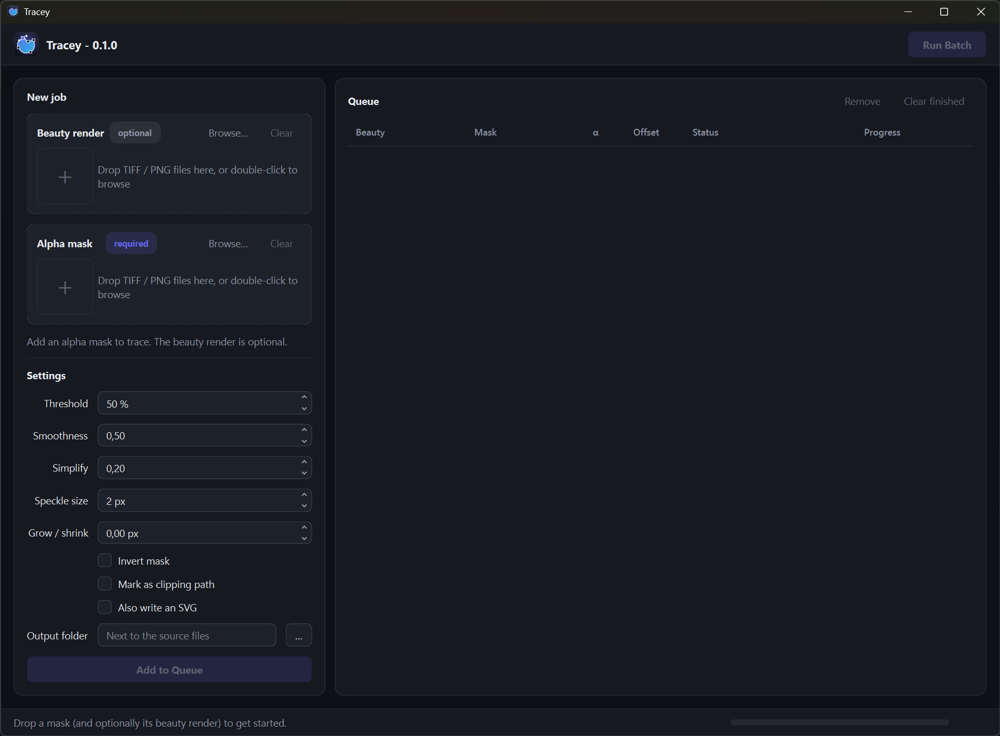

# Tracey

Traces alpha masks into Photoshop paths with [potracer](https://pypi.org/project/potracer/)
and embeds them into TIFFs.



```
uv run tracey                       # desktop UI
uv run potrace image.png -a 0.8     # command line
```

## UI

1. Drop an **alpha mask** (required) and, optionally, the **beauty render** (TIFF / PNG).
   Both fields take several files at once; masks and beauties are paired in name order.
   Files dropped anywhere on the window go to the mask field if their name contains
   `mask`, `alpha` or `matte`, otherwise to the beauty field.
2. Adjust the settings and click **Add to Queue**. Settings are stored with each job.
3. **Run Batch** traces every job that isn't done yet. Double-click a row to open its folder.

The mask's alpha channel is traced if it has one, its luminance otherwise. The path is saved
into the beauty render (or into the mask when there is none) as `<name>.tif`, scaled to fit if
the mask has a different resolution than the beauty.

## Development

```
uv run ruff check           # lint
uv run ruff format          # format
uv run ty check             # type check
```

## Executables

```
uv run scripts/build.py           # add --clean to drop the build cache
```

builds `dist/Tracey-windows-x64.exe` on Windows, and `dist/Tracey.app` plus
`dist/Tracey-macos-arm64.zip` on macOS (PyInstaller can't cross-compile, so each is built
on its own OS). All PyInstaller settings live in `scripts/build.py`. The GitHub workflow in
`.github/workflows/build.yml` lints and type checks every push and pull request, and builds
the Windows x64 and macOS arm64 (Apple silicon) executables for pushes to `main`, manual runs and
`v*` tags. A tag also publishes them as a GitHub release:

```
git tag v0.1.0 && git push origin v0.1.0
```

The macOS app isn't signed or notarized. After downloading, allow it with right-click → Open,
or `xattr -dr com.apple.quarantine Tracey.app`.
